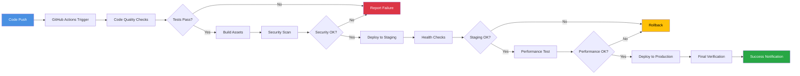
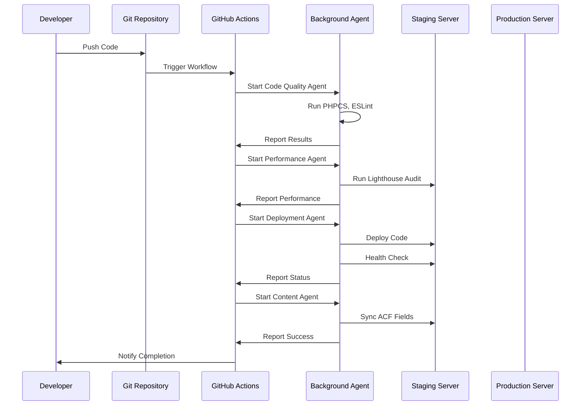

# BCN Deployment Pipeline

```mermaid
gitgraph
    commit id: "Initial Commit"
    branch develop
    checkout develop
    commit id: "Feature: Member Cards"
    commit id: "Feature: Event Calendar"
    branch feature/member-directory
    checkout feature/member-directory
    commit id: "Enhanced Member Directory"
    commit id: "Filtering System"
    checkout develop
    merge feature/member-directory
    commit id: "Merge: Member Directory"
    checkout main
    merge develop
    commit id: "Release v1.0.0"
    tag: "v1.0.0"
```

## CI/CD Pipeline Flow



## Background Agents Workflow

