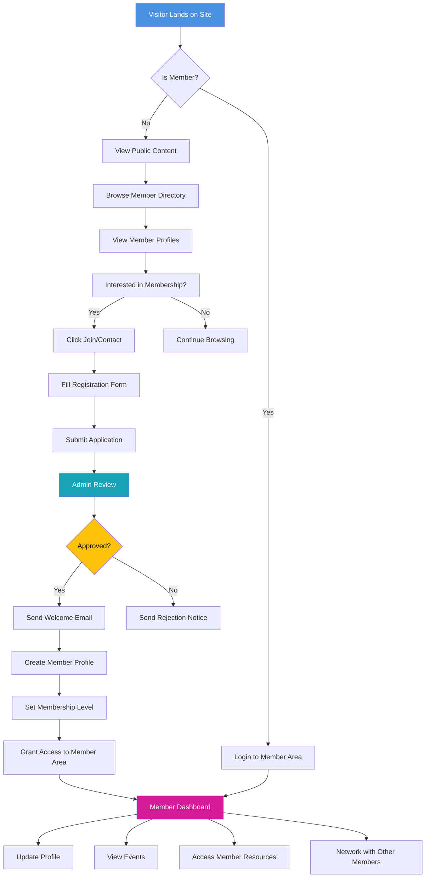
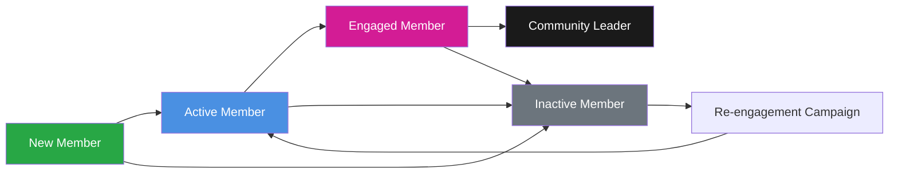

# Member Registration and Engagement Flow

```mermaid
flowchart TD
    A[Visitor Lands on Site] --> B{Is Member?}
    B -->|No| C[View Public Content]
    B -->|Yes| D[Login to Member Area]
    
    C --> E[Browse Member Directory]
    E --> F[View Member Profiles]
    F --> G[Interested in Membership?]
    G -->|Yes| H[Click Join/Contact]
    G -->|No| I[Continue Browsing]
    
    H --> J[Fill Registration Form]
    J --> K[Submit Application]
    K --> L[Admin Review]
    L --> M{Approved?}
    M -->|Yes| N[Send Welcome Email]
    M -->|No| O[Send Rejection Notice]
    
    N --> P[Create Member Profile]
    P --> Q[Set Membership Level]
    Q --> R[Grant Access to Member Area]
    R --> S[Member Dashboard]
    
    S --> T[Update Profile]
    S --> U[View Events]
    S --> V[Access Member Resources]
    S --> W[Network with Other Members]
    
    D --> S
    
    style A fill:#4A90E2,color:#fff
    style S fill:#D31C95,color:#fff
    style M fill:#ffc107,color:#000
    style L fill:#17a2b8,color:#fff
```

## Member Engagement Levels

```mermaid
graph LR
    A[New Member] --> B[Active Member]
    B --> C[Engaged Member]
    C --> D[Community Leader]
    
    A --> E[Inactive Member]
    B --> E
    C --> E
    
    E --> F[Re-engagement Campaign]
    F --> B
    
    style A fill:#28a745,color:#fff
    style B fill:#4A90E2,color:#fff
    style C fill:#D31C95,color:#fff
    style D fill:#1A1A1A,color:#fff
    style E fill:#6c757d,color:#fff
```