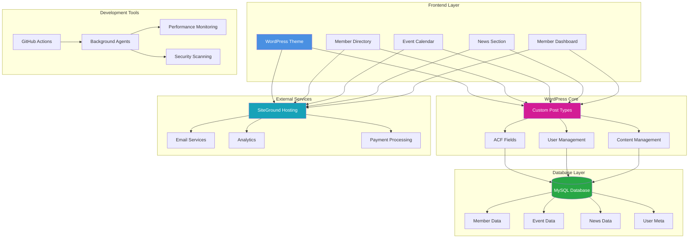
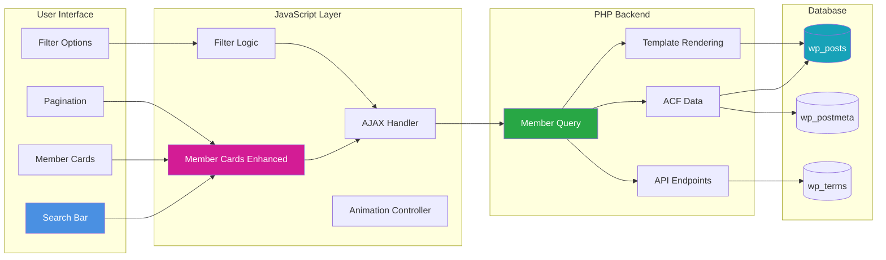

# BCN System Architecture

```mermaid
graph TB
    subgraph "Frontend Layer"
        A[WordPress Theme]
        B[Member Directory]
        C[Event Calendar]
        D[News Section]
        E[Member Dashboard]
    end
    
    subgraph "WordPress Core"
        F[Custom Post Types]
        G[ACF Fields]
        H[User Management]
        I[Content Management]
    end
    
    subgraph "Database Layer"
        J[(MySQL Database)]
        K[Member Data]
        L[Event Data]
        M[News Data]
        N[User Meta]
    end
    
    subgraph "External Services"
        O[SiteGround Hosting]
        P[Email Services]
        Q[Analytics]
        R[Payment Processing]
    end
    
    subgraph "Development Tools"
        S[GitHub Actions]
        T[Background Agents]
        U[Performance Monitoring]
        V[Security Scanning]
    end
    
    A --> F
    B --> F
    C --> F
    D --> F
    E --> F
    
    F --> G
    F --> H
    F --> I
    
    G --> J
    H --> J
    I --> J
    
    J --> K
    J --> L
    J --> M
    J --> N
    
    A --> O
    B --> O
    C --> O
    D --> O
    E --> O
    
    O --> P
    O --> Q
    O --> R
    
    S --> T
    T --> U
    T --> V
    
    style A fill:#4A90E2,color:#fff
    style F fill:#D31C95,color:#fff
    style J fill:#28a745,color:#fff
    style O fill:#17a2b8,color:#fff
```

## Member Directory Architecture

```mermaid
graph LR
    subgraph "User Interface"
        A[Search Bar]
        B[Filter Options]
        C[Member Cards]
        D[Pagination]
    end
    
    subgraph "JavaScript Layer"
        E[Member Cards Enhanced]
        F[Filter Logic]
        G[AJAX Handler]
        H[Animation Controller]
    end
    
    subgraph "PHP Backend"
        I[Member Query]
        J[ACF Data]
        K[Template Rendering]
        L[API Endpoints]
    end
    
    subgraph "Database"
        M[(wp_posts)]
        N[(wp_postmeta)]
        O[(wp_terms)]
    end
    
    A --> E
    B --> F
    C --> E
    D --> E
    
    E --> G
    F --> G
    G --> I
    
    I --> J
    I --> K
    I --> L
    
    J --> M
    J --> N
    K --> M
    L --> O
    
    style A fill:#4A90E2,color:#fff
    style E fill:#D31C95,color:#fff
    style I fill:#28a745,color:#fff
    style M fill:#17a2b8,color:#fff
```